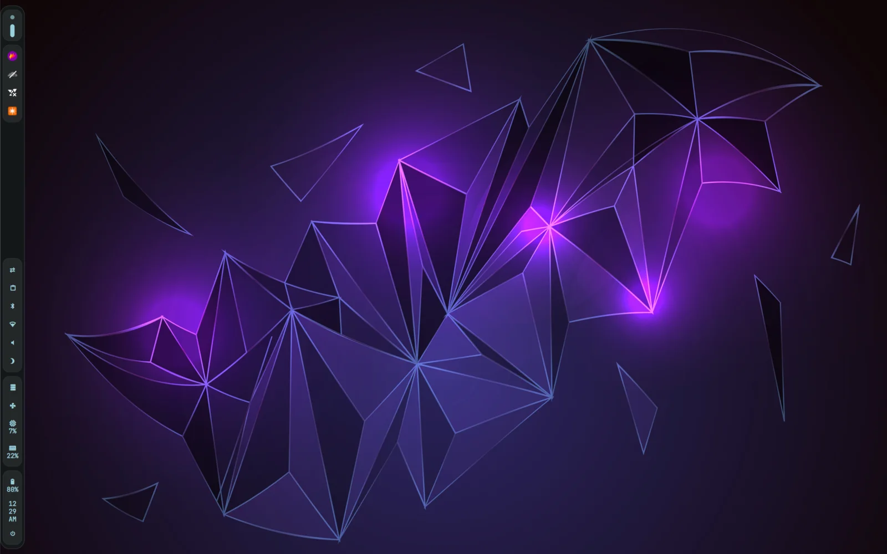
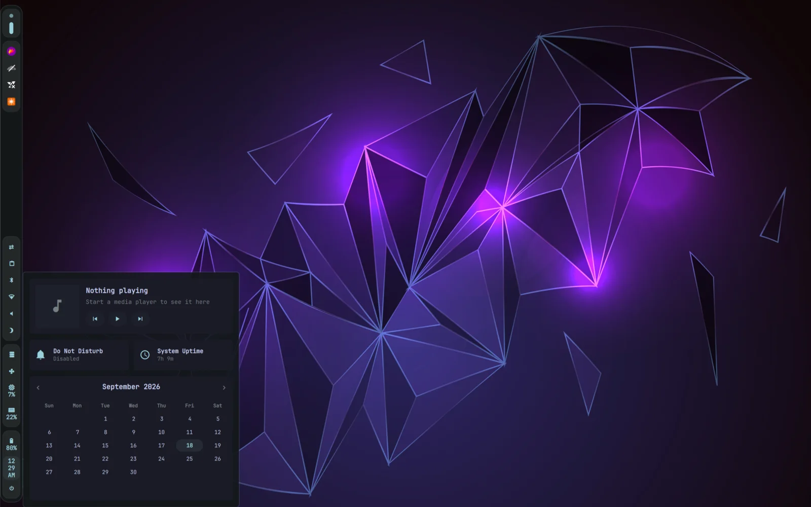
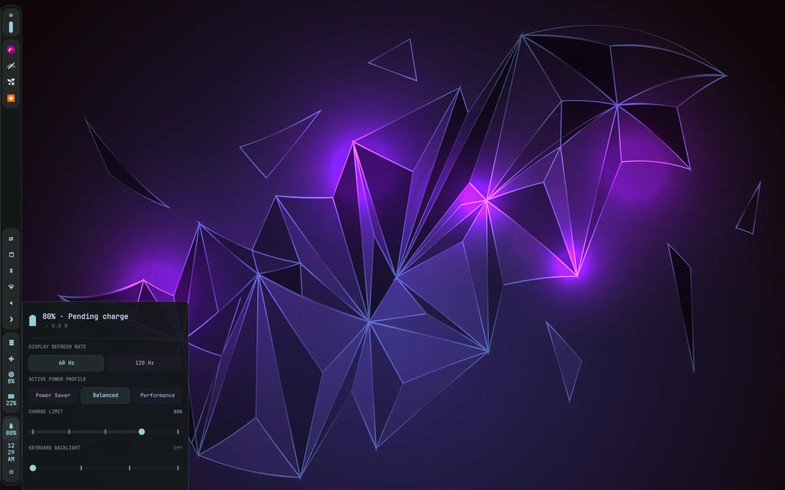

# Jonathan's Dotfiles

A dark Wayland desktop built around Niri and Quickshell. The interface uses a
blue-gray palette with a cyan accent, semantic status colors, JetBrains Mono
Nerd Font, and Papirus icons. It is configured for an ASUS laptop with a
2880x1800 Samsung OLED panel.

## Screenshots



| Clock dashboard | Power drawer |
|:----------------:|:------------:|
|  |  |

## Requirements

| Package | Purpose |
|---------|---------|
| `git`, GNU Stow | Clone and deploy the repository |
| `niri` | Scrollable-tiling Wayland compositor |
| `quickshell` | Per-output bar, OSD, dashboards, lock screen, and power controls |
| `ghostty` | Terminal emulator |
| `rofi` | Application launcher |
| `wl-clipboard` + `cliphist` | Wayland clipboard access and searchable clipboard history |
| Flameshot 14 | Screenshot capture and annotation; installed separately as `~/.local/bin/flameshot-v14` |
| `mako` | Notifications and do-not-disturb mode |
| `xdg-desktop-portal-gnome`, `xdg-desktop-portal-gtk`, GNOME Keyring | Preferred portal backend, GTK Access/Notification fallback, and Secret portal |
| `swayidle` | Idle dimming, locking, display power, and suspend handling |
| `gtklock` plus playerctl, powerbar, and userinfo modules | Fallback locker when Quickshell cannot acquire session lock |
| `waypaper` + `awww` | Wallpaper selection and restoration |
| `wlogout` | Session and power menu |
| `resources` | System resource monitor launched from the bar |
| `thunar`, `pavucontrol`, `blueman` | File, audio, and Bluetooth utilities |
| NetworkManager (`nmcli`, `nmtui`), BlueZ (`bluetoothctl`) | Network and Bluetooth status and controls |
| `brightnessctl`, `wpctl`, `playerctl` | Brightness, audio, and media controls |
| `jq`, `upower`, `procps` | JSON processing, battery telemetry, and process toggles |
| `powerprofilesctl`, compatible `asusctl`/`asusd` | ASUS laptop power, fan, and firmware controls |
| `systemd` (`busctl`), `util-linux` (`flock`) | Safe GPU-mode queue inspection and serialization |
| NVIDIA utilities (`nvidia-smi`, optional) | Ultimate-mode temperature fallback when PCI hwmon is unavailable |
| JetBrains Mono Nerd Font, Papirus | Interface font and icon theme |
| Zsh, Oh My Zsh, `zsh-syntax-highlighting`, Starship, Fastfetch | Interactive shell and prompt configured by the recommended Stow set |
| Neovim, Tmux, OpenCode | Editor, terminal multiplexer, and coding agent configured by the recommended Stow set |

The optional `autostart` package expects NetBird UI to be installed.

The ASUS controls are machine-specific. Niri matches the Samsung
ATNA40CU05-0 panel by EDID and starts it at `2880x1800@60.001`, scale 1.75,
position `(0,0)`. The power drawer offers 60 Hz and 120 Hz when those modes are
advertised. Runtime helpers discover the connector, DRM card, backlight, and
system battery instead of relying on probe-order names such as `eDP-1`,
`card1`, `amdgpu_bl1`, or `BAT1`. Power profiles use `powerprofilesctl`; ASUS
charge limits, keyboard lighting, fan metadata, and GPU firmware attributes use
`asusctl`/`asusd`.

## Contents

| Config | Description |
|--------|-------------|
| Niri | Scrollable tiling, input/output configuration, window rules, startup services, and keybindings |
| Quickshell | Per-output bar that toggles between a left rail and top layout; workspaces, tray, active window, system controls, OSD, lock screen, and clock/power/fan drawers |
| Systemd | Unified sleep policy and ASUS keyboard-backlight restoration across resume |
| Ghostty | Box theme with transparency and blur |
| Rofi | Dark application launcher with Papirus icons |
| Mako | Compact notifications with urgency-colored borders |
| Waypaper | Wallpaper picker using the `awww` backend |
| Wlogout | Styled logout and power actions |
| GTKlock | Fallback lock-screen configuration |
| Flameshot | Flameshot 14 configuration; the executable is installed separately |
| Autostart | Machine-specific NetBird UI launcher and Blueman applet suppression |
| Neovim | Lua configuration using `lazy.nvim`, Snacks, Oil, Neogit, and Gitsigns |
| Zsh | Oh My Zsh, syntax highlighting, and Starship |
| Tmux | Vi copy mode, mouse support, and a minimal status line |
| Fastfetch | Custom system-information layout and ASCII art |
| Git | Personal Git identity |
| Scripts | Reboot-only ASUS graphics-mode switching command |
| OpenCode | Model selection and global engineering instructions |

The `sway/` compositor config, Niri-oriented `waybar/` config, and `swayosd/`
config are retained legacy alternatives. The active session uses Niri and
Quickshell's bar and OSD.

### Quickshell Interface

Each output gets a bar. It starts as a segmented vertical rail on the left and
can be switched to a top horizontal layout for the running session. Both
orientations provide workspace navigation, a system-tray segment, clipboard
history, Bluetooth and network status, volume and brightness controls, live
CPU/RAM indicators, a Resources toggle, battery status, and a wlogout launcher.
The displayed application is the active window on that output's active
workspace.

The clock drawer contains MPRIS artwork and transport controls, Mako DND,
uptime, and a navigable calendar. The power drawer shows battery state and
power draw and controls display refresh rate, active power profile, ASUS charge
limit, and keyboard backlight. The fan drawer monitors CPU, GPU, and MID fan
RPM and available curve metadata. Drawers open to the right of the vertical
rail or below the horizontal bar.

At session start, Niri launches Quickshell, Mako, `awww-daemon`, Waypaper
restoration, text and image clipboard watchers, and `swayidle`. Quickshell owns
the Flameshot tray process. XDG autostart starts NetBird UI and suppresses the
Blueman applet; Bluetooth management remains available from the bar.

## Power Behavior

Niri leaves power-key handling to systemd-logind. Lid close, the physical power
or sleep key, the lock-screen **Sleep** action, and the idle timeout suspend.
This policy applies on battery and AC power, while a docked lid close is
ignored. Hibernation is intentionally unused because Secure Boot places the
kernel in integrity lockdown mode and this system reports hibernation as
unavailable. A system-sleep hook preserves the ASUS keyboard-backlight level
across suspend and resume.

The idle sequence is:

| Idle time | Action |
|-----------|--------|
| 270 seconds | Save brightness and dim the internal display to 10%; activity restores it |
| 300 seconds | Lock through the Quickshell lock helper |
| 400 seconds | Power off displays; activity powers them back on |
| 500 seconds | Suspend through systemd |

The lock helper also runs before every sleep. It starts a separate
`LockShell.qml` instance, waits for the Wayland session lock to report secure,
and falls back to GTKlock after about ten seconds if acquisition fails.

The Quickshell lock screen uses PAM's `login` service, a 12-hour clock with
AM/PM, live battery state, password visibility and reveal-delay settings, and
a wallpaper picker. Restart, sleep, logout, and power-off require confirmation;
logout terminates all sessions for the current user. The selected lock
wallpaper is independent of Waypaper and persists in Quickshell state. GTKlock
uses `Karina5.jpg` when it is needed as the fallback.

### Fan Curves

The fan panel is monitor-only and polls the ASUS CPU, GPU, and MID fan RPM sensors once per second while visible. Every card continuously shows measured RPM, including a valid stopped state. CPU and GPU show their curve target as secondary information when an enabled custom curve and controlling temperature are available; otherwise they identify firmware control or unavailable telemetry. MID is RPM-only because this laptop exposes its fan speed but not its controlling temperature.

NVIDIA temperature is read only in dGPU MUX mode, where NVIDIA cannot runtime-suspend. Integrated mode reports the dGPU disabled. Hybrid reports active or suspended when runtime status is available, otherwise unavailable, without querying NVIDIA telemetry, so polling cannot wake the dGPU or delay suspension. Live RPM and temperature data updates once per second; ASUS profile and curve metadata updates every 15 seconds to avoid repeated daemon calls. The cards are persistent rather than rebuilt on each telemetry sample, so polling cannot disrupt hover or click state. Use `asusctl` to manage custom curves:

```bash
# Inspect one profile.
asusctl fan-curve --mod-profile Balanced

# Enable or disable all custom curves for one profile.
asusctl fan-curve --mod-profile Balanced --enable-fan-curves true
asusctl fan-curve --mod-profile Balanced --enable-fan-curves false

# Restore the active profile's firmware-default curves.
asusctl fan-curve --default

# Set one eight-point curve.
asusctl fan-curve --mod-profile Balanced --fan cpu \
  --data '30c:1%,49c:2%,59c:10%,69c:20%,79c:35%,89c:55%,99c:75%,109c:100%'
```

### Graphics Modes

`gpu-mode` uses the ASUS firmware attributes exposed by `asusd`; it does not
unload GPU drivers or remove PCI devices from the running desktop. Changes are
queued in memory and applied by `asus-shutdown` after graphical sessions exit,
then the machine reboots immediately:

```bash
gpu-mode status
gpu-mode --get       # Machine-readable mode used by fan telemetry.
gpu-mode integrated
gpu-mode hybrid
gpu-mode ultimate
```

Integrated sets `dgpu_disable=1` with the MUX in Optimus mode, Hybrid enables
the dGPU while retaining Optimus mode, and Ultimate enables the dGPU with the
hardware MUX in discrete mode. The command verifies both queued firmware values
before requesting a reboot and neutralizes the queue if verification or the
reboot request fails. It requires compatible Armoury attribute support in
`asusctl`/`asusd`, an active `asus-shutdown.service`, `busctl`, `systemctl`, and
`flock`. Use `--yes` only for intentional non-interactive use.

`gpu-mode status` reports the raw and queued firmware values, configured mode,
dGPU runtime power state, and relevant service states. A suspended dGPU is
normal while Hybrid is configured. `--get` only reads the configured firmware
mode; mode-changing commands additionally require `asus-shutdown.service`,
`flock`, queue verification through `busctl`, and reboot authorization.

## Keymaps

> `Mod` is the Super/Windows key.

Directional bindings follow a consistent hierarchy: `Mod` focuses, `Mod+Shift`
moves the focused window or column, `Mod+Ctrl` focuses another monitor, and
`Mod+Ctrl+Shift` moves across monitors or reorders an entire workspace.

### General

| Keybind | Action |
|---------|--------|
| `Mod+Shift+/` | Show the Niri hotkey overlay |
| `Mod+Return` | Open Ghostty |
| `Mod+D` | Toggle Rofi |
| `Mod+E` | Terminate an existing Thunar process or launch Thunar |
| `Mod+W` | Toggle Waypaper |
| `Super+Alt+L` | Lock the session |
| `Mod+Q` | Close the focused window |
| `Mod+O` | Toggle the Niri overview |
| `F6` | Capture and annotate a screenshot with Flameshot |
| `Mod+Ctrl+V` | Open clipboard history in Rofi |

### Focus and Movement

| Keybind | Action |
|---------|--------|
| `Mod+H/J/K/L` | Focus the column left/right or window down/up |
| `Mod+Shift+H/J/K/L` | Move the column left/right or window down/up |
| `Mod+Home/End` | Focus the first/last column |
| `Mod+Shift+Home/End` | Move the column to the first/last position |

### Columns and Windows

| Keybind | Action |
|---------|--------|
| `Mod+[` | Consume into or expel from the column on the left |
| `Mod+]` | Consume into or expel from the column on the right |
| `Mod+,` | Consume one window from the right into the focused column |
| `Mod+.` | Expel the bottom window from the focused column to the right |
| `Mod+R` | Cycle forward through preset column widths |
| `Mod+Shift+R` | Cycle backward through preset column widths |
| `Mod+Ctrl+Shift+R` | Cycle through preset window heights |
| `Mod+Ctrl+R` | Reset the focused window height |
| `Mod+F` | Maximize the current column |
| `Mod+Shift+F` | Toggle fullscreen |
| `Mod+M` | Maximize the window to the screen edges |
| `Mod+Ctrl+F` | Expand the column to the available width |
| `Mod+C` | Center the focused column |
| `Mod+Ctrl+C` | Center all visible columns |
| `Mod+-` / `Mod+=` | Decrease/increase the column width by 10% |
| `Mod+Shift+-` / `Mod+Shift+=` | Decrease/increase the window height by 10% |
| `Mod+V` | Toggle the focused window between floating and tiled |
| `Mod+Shift+V` | Switch focus between floating and tiled windows |
| `Mod+Shift+W` | Toggle tabbed columns |

### Workspaces

| Keybind | Action |
|---------|--------|
| `Mod+U` / `Mod+I` | Focus workspace down/up |
| `Mod+Shift+U/I` | Move the current column to the workspace down/up |
| `Mod+Ctrl+Shift+U/I` | Reorder the entire workspace down/up |
| `Mod+1-9` | Focus a numbered workspace |
| `Mod+Shift+1-9` | Move the current column to a numbered workspace |

### Monitors

| Keybind | Action |
|---------|--------|
| `Mod+Ctrl+H/J/K/L` | Focus the monitor left/down/up/right |
| `Mod+Ctrl+Arrow keys` | Focus a monitor by direction |
| `Mod+Ctrl+Shift+H/J/K/L` | Move the current column to a monitor |
| `Mod+Ctrl+Shift+Arrow keys` | Move the current column to a monitor |

### Mouse Navigation

| Keybind | Action |
|---------|--------|
| `Mod+Wheel up/down` | Focus the workspace up/down |
| `Mod+Shift+Wheel up/down` | Move the current column to the workspace up/down |
| `Mod+Wheel left/right` | Focus the column left/right |
| `Mod+Shift+Wheel left/right` | Move the column left/right |

### Audio, Brightness, and Media

These hardware keys remain active while the session is locked. The normal
Quickshell instance shows a bottom-center OSD on the focused output for volume,
microphone mute, display brightness, keyboard-backlight level, media actions,
and Caps/Num/Scroll Lock changes while the session is unlocked.

| Keybind | Action |
|---------|--------|
| `XF86AudioRaiseVolume` (volume up) | Raise the default output volume through PipeWire |
| `XF86AudioLowerVolume` (volume down) | Lower the default output volume through PipeWire |
| `XF86AudioMute` (volume mute) | Toggle the default output mute through PipeWire |
| `XF86AudioMicMute` (microphone mute) | Toggle the default input mute through PipeWire |
| `XF86MonBrightnessUp` (brightness up) | Raise the runtime-selected display backlight |
| `XF86MonBrightnessDown` (brightness down) | Lower the runtime-selected display backlight |
| `XF86KbdBrightnessUp` (keyboard light up) | Raise the ASUS keyboard-backlight level |
| `XF86KbdBrightnessDown` (keyboard light down) | Lower the ASUS keyboard-backlight level |
| `XF86AudioPlay` / `XF86AudioPause` | Toggle playback through `playerctl` |
| `XF86AudioStop` | Stop playback through `playerctl` |
| `XF86AudioPrev` | Play the previous track through `playerctl` |
| `XF86AudioNext` | Play the next track through `playerctl` |

### Session and Displays

| Keybind | Action |
|---------|--------|
| `Mod+Escape` | Toggle whether applications can inhibit Niri shortcuts |
| `Mod+Shift+P` | Power off all monitors |
| `Ctrl+Alt+Delete` | Quit Niri |

## Usage

The repository uses a GNU Stow package layout. Clone it into `~/dotfiles`, then link the packages you want:

```bash
git clone git@github.com:FireNaruto3/dotfiles.git ~/dotfiles
cd ~/dotfiles
stow niri quickshell flameshot ghostty nvim rofi mako wlogout \
  fastfetch git starship tmux zsh waypaper gtklock autostart opencode scripts
```

The `autostart` package is machine-specific because it enables NetBird UI. The
`git` package contains a personal name and email address; omit either package
when deploying to a different machine or user.

Keep the repository at `~/dotfiles`: the wallpaper directory and Fastfetch logo
use that location. Most home paths use `$HOME` or `~`; Waypaper's stylesheet is
currently stored as the machine-specific absolute path
`/home/jonathan/.config/waypaper/style.css`. If the repository or account moves,
update these references before starting the desktop.

The active Quickshell fan telemetry calls `~/.local/bin/gpu-mode` to select a
GPU-safe temperature path, so stow the `scripts` package whenever using the
Quickshell package.

Flameshot 14 must be installed separately at `~/.local/bin/flameshot-v14`; the
`flameshot` Stow package supplies configuration only. Ubuntu's packaged 13.3
release crops captures on the laptop's 1.75-scale display. Quickshell starts the
tray process, and `F6` runs `flameshot-v14 gui`. Niri's built-in screenshot path
is configured under `~/Pictures/Screenshots`, but no built-in screenshot action
is currently bound.

System-wide files are tracked under `system/` and installed as root-owned copies rather than user-writable symlinks:

```bash
sudo install -D -o root -g root -m 0644 \
  system/etc/systemd/logind.conf.d/90-sleep-policy.conf \
  /etc/systemd/logind.conf.d/90-sleep-policy.conf

sudo install -D -o root -g root -m 0755 \
  system/usr/lib/systemd/system-sleep/asus-keyboard-backlight \
  /usr/lib/systemd/system-sleep/asus-keyboard-backlight

sudo install -D -o root -g root -m 0644 \
  system/etc/modprobe.d/asus-nvidia.conf \
  /etc/modprobe.d/asus-nvidia.conf

# Preserve and disable the previous suspend-then-hibernate policy, if installed.
if [ -e /etc/systemd/sleep.conf.d/90-hibernate-delay.conf ] && \
   [ ! -e /etc/systemd/sleep.conf.d/90-hibernate-delay.conf.disabled ]; then
  sudo mv /etc/systemd/sleep.conf.d/90-hibernate-delay.conf \
    /etc/systemd/sleep.conf.d/90-hibernate-delay.conf.disabled
fi

sudo systemctl reload systemd-logind.service
```

Module options may be copied into the initramfs by the distribution. After
installing or changing `asus-nvidia.conf`, regenerate the initramfs with the
distribution's normal tooling when applicable, then reboot before relying on
the new NVIDIA or backlight policy. `systemctl daemon-reload` does not apply
modprobe changes.

For the one-time migration from Supergfx, disable its daemon after installing
`asus-nvidia.conf`, then move configuration files only when they exist and no
backup is already present:

```bash
sudo systemctl disable --now supergfxd.service

if [ -e /etc/supergfxd.conf ] && \
   [ ! -e /etc/supergfxd.conf.supergfx-disabled ]; then
  sudo mv /etc/supergfxd.conf /etc/supergfxd.conf.supergfx-disabled
fi

if [ -e /etc/modprobe.d/supergfxd.conf ] && \
   [ ! -e /etc/modprobe.d/supergfxd.conf.supergfx-disabled ]; then
  sudo mv /etc/modprobe.d/supergfxd.conf \
    /etc/modprobe.d/supergfxd.conf.supergfx-disabled
fi
```

The `supergfxctl` package may remain installed, but `supergfxd.service` must not
run alongside ASUS firmware-managed mode switching. If Supergfx previously
renamed `/usr/share/vulkan/icd.d/nvidia_icd.json` to
`nvidia_icd.json_inactive`, restore the original filename before using Hybrid
or Ultimate mode:

```bash
if [ ! -e /usr/share/vulkan/icd.d/nvidia_icd.json ] && \
   [ -e /usr/share/vulkan/icd.d/nvidia_icd.json_inactive ]; then
  sudo mv /usr/share/vulkan/icd.d/nvidia_icd.json_inactive \
    /usr/share/vulkan/icd.d/nvidia_icd.json
fi
```

Alternatively, reinstall the NVIDIA package that owns the ICD file.

Secure Boot remains enabled. The kernel's integrity lockdown disables
hibernation, so no hibernation sleep policy or static `resume=` configuration
is installed.

Wallpapers remain in `~/dotfiles/wallpapers` because Waypaper and the lock
screen reference that directory. Waypaper controls the desktop wallpaper. The
Quickshell lock picker independently discovers JPG, JPEG, PNG, WebP, and AVIF
files there and persists its selection; adding a file does not select it
automatically.

## Validation

Run the focused checks after changing the active desktop or GPU-mode helper:

```bash
niri validate -c niri/.config/niri/config.kdl
bash -n quickshell/.config/quickshell/scripts/*.sh \
  scripts/.local/bin/gpu-mode tests/gpu-mode.sh
sh -n quickshell/.config/quickshell/scripts/clipboard-history.sh \
  quickshell/.config/quickshell/scripts/lock.sh \
  system/usr/lib/systemd/system-sleep/asus-keyboard-backlight
bash tests/gpu-mode.sh
```

These checks cover the active desktop and GPU helper, not the retained legacy
configs. Quickshell QML, IPC, tray integration, drawers, and OSD still require
runtime validation. Do not launch `LockShell.qml` as a syntax check because it
attempts to acquire the Wayland session lock.
