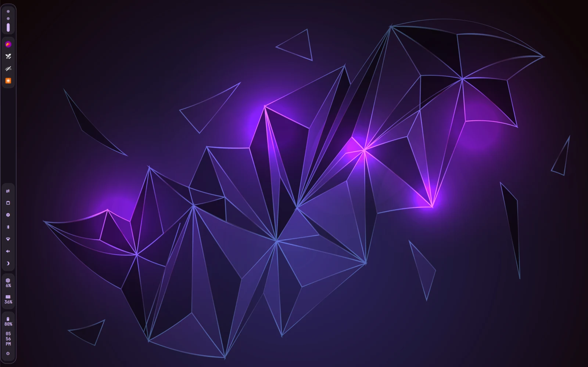
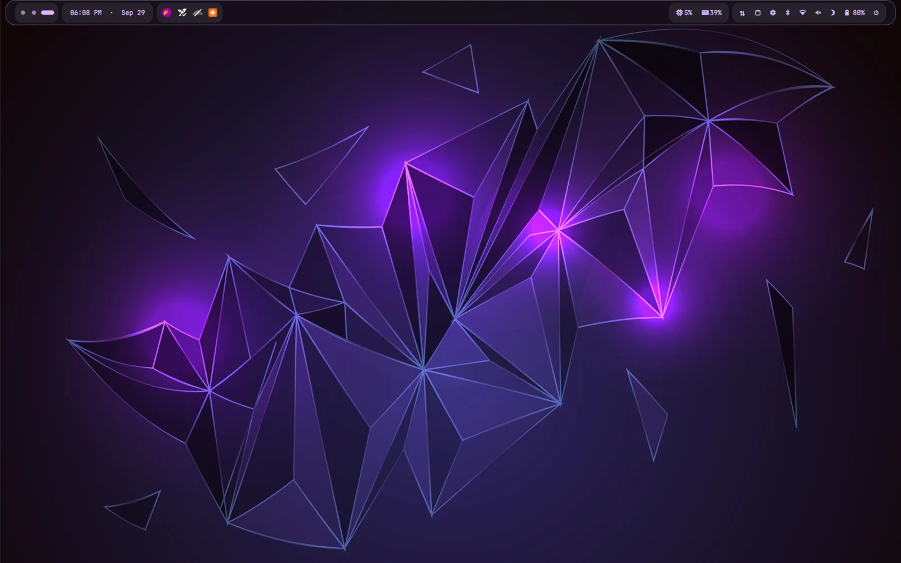
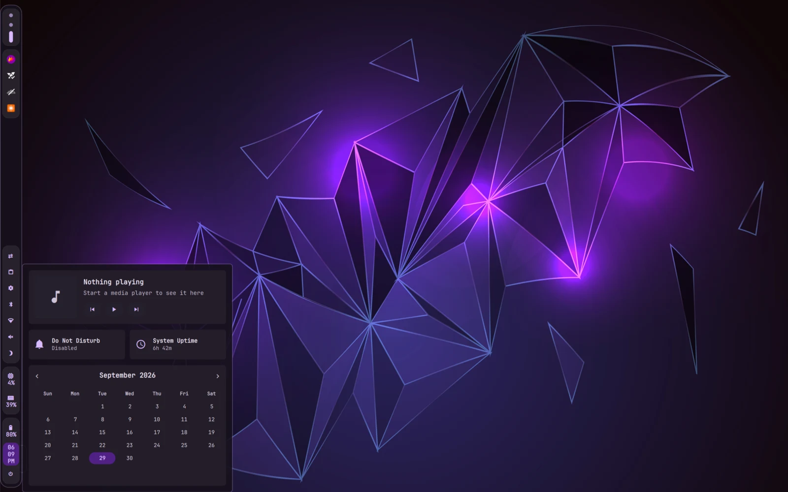
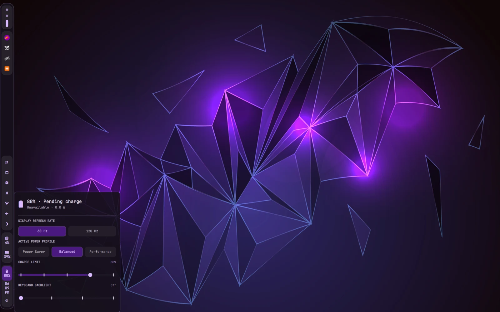

# FireNaruto3's Dotfiles

A dark Wayland desktop built around Niri and Quickshell. The interface uses a
blue-gray palette with a cyan accent, semantic status colors, JetBrains Mono
Nerd Font, and Papirus icons. It is configured for an ASUS laptop with a
2880x1800 Samsung OLED panel.

This is a personal, machine-specific configuration, not a turnkey Ubuntu
distribution. Read the commands and review package-specific settings before
linking anything into `$HOME` or installing the root-owned files. In particular,
the display, ASUS, NVIDIA, NetBird, Git, OpenCode, and Waypaper stylesheet
settings may not suit another machine.

## Screenshots

### Bar Layouts

| Vertical rail | Horizontal bar |
|:-------------:|:--------------:|
|  |  |

### Drawers

| Clock dashboard | Power drawer |
|:----------------:|:------------:|
|  |  |

## Requirements

### Tested Baseline And Pins

| Component | Tested or pinned version |
|-----------|--------------------------|
| Ubuntu | 26.04.1 LTS |
| Niri | 26.04 (`v26.04-36-g49fc6117` tested) |
| Quickshell | 0.3.1 tested |
| GNU Stow | 2.4.1 tested |
| Matugen | 4.2.0 pinned for installation |
| Neovim | 0.13 development build tested; lazy.nvim itself requires Neovim 0.8+ |
| lazy.nvim | `85c7ff3711b730b4030d03144f6db6375044ae82` (11.17.5), pinned in bootstrap and lockfile |
| Flameshot | 14, installed as `~/.local/bin/flameshot-v14` |
| OpenCode | 1.18.32 tested |

These are reproducibility notes, not claims that every version is packaged by
Ubuntu. Niri, Quickshell, Matugen, awww, Resources, ASUS Linux utilities,
OpenCode, and Flameshot 14 may require their upstream repositories or release
artifacts. Verify signatures or checksums and follow each upstream project's
Ubuntu instructions.

| Package | Purpose |
|---------|---------|
| `git`, GNU Stow | Clone and deploy the repository |
| `niri` | Scrollable-tiling Wayland compositor |
| `quickshell` | Per-output bar, OSD, dashboards, lock screen, and power controls |
| `ghostty` | Terminal emulator |
| `rofi` | Application launcher |
| `wl-clipboard` + `cliphist` | Wayland clipboard access and searchable clipboard history |
| Flameshot 14 | Screenshot capture and annotation; installed separately as `~/.local/bin/flameshot-v14` |
| `mako` | Notifications and do-not-disturb mode |
| `xdg-desktop-portal-gnome`, `xdg-desktop-portal-gtk`, GNOME Keyring | Preferred portal backend, GTK Access/Notification fallback, and Secret portal |
| `swayidle` | Idle dimming, locking, display power, and suspend handling |
| `waypaper` + `awww` | Wallpaper selection and restoration |
| `matugen` | Wallpaper-derived colors for the active desktop applications |
| `wlogout` | Session and power menu |
| `resources` | System resource monitor launched from the bar |
| `thunar`, `pavucontrol`, `blueman` | File, audio, and Bluetooth utilities |
| NetworkManager (`nmcli`, `nmtui`), BlueZ (`bluetoothctl`) | Network and Bluetooth status and controls |
| `brightnessctl`, `wpctl`, `playerctl` | Brightness, audio, and media controls |
| `jq`, `upower`, `procps`, `libnotify-bin` | JSON processing, battery telemetry, process toggles, and desktop failure notifications |
| `powerprofilesctl`, compatible `asusctl`/`asusd` | ASUS laptop power, fan, and firmware controls |
| `systemd` (`busctl`, `loginctl`, `systemctl`, `systemd-run`), `util-linux` (`flock`, `logger`, `runuser`, `setsid`), GNU Coreutils (`timeout`) | Lock/suspend orchestration, GPU-mode queue inspection, logging, and bounded execution |
| NVIDIA utilities (`nvidia-smi`, optional) | Ultimate-mode temperature fallback when PCI hwmon is unavailable |
| JetBrains Mono Nerd Font, Papirus | Interface font and icon theme |
| Zsh, Oh My Zsh, `zsh-syntax-highlighting`, Starship, Fastfetch | Interactive shell and prompt configured by the recommended Stow set |
| Neovim, Tmux, OpenCode | Editor, terminal multiplexer, and coding agent configured by the recommended Stow set |

The optional `autostart` package expects NetBird UI to be installed. Before
deploying, use this Ubuntu checklist:

- Update the system and install Git, GNU Stow, the Wayland utilities, desktop
  applications, fonts, portals, and command-line dependencies listed above.
- Install the tested Niri and Quickshell versions, or review upstream changes
  before using newer versions.
- Confirm `niri`, `qs`, `stow`, `git`, `bash`, `sh`, `jq`, `brightnessctl`,
  `wpctl`, `playerctl`, `upower`, `flock`, `logger`, `loginctl`, `notify-send`,
  `pgrep`, `pkill`, `runuser`, `setsid`, `systemd-run`, and `timeout` are on
  `PATH`.
- Confirm the GNOME and GTK portal backends and GNOME Keyring are installed.
- Install Matugen 4.2.0 with
  `cargo install matugen --version 4.2.0 --locked` and install awww before
  starting the session.
- Install compatible `asusctl`/`asusd` only on supported ASUS hardware. Do not
  install the repository's module or sleep policy on unrelated systems.
- Install Flameshot 14 at the configured path, or change the Niri and
  Quickshell references together.
- Review optional packages (`autostart`, `git`, and `opencode`) before stowing
  them because they have machine-wide or account-wide effects.

The ASUS controls are machine-specific. Niri matches the Samsung
ATNA40CU05-0 panel by EDID and starts it at `2880x1800@60.001`, scale 1.75,
position `(0,0)`. The power drawer offers 60 Hz and 120 Hz when those modes are
advertised. Runtime helpers discover the connector, DRM card, backlight, and
system battery instead of relying on probe-order names such as `eDP-1`,
`card1`, `amdgpu_bl1`, or `BAT1`. Power profiles use `powerprofilesctl`; ASUS
charge limits, keyboard lighting, fan metadata, and GPU firmware attributes use
`asusctl`/`asusd`.

## Contents

| Config | Description |
|--------|-------------|
| Niri | Scrollable tiling, input/output configuration, window rules, startup services, and keybindings |
| Quickshell | Per-output bar that toggles between a left rail and top layout; workspaces, tray, active window, system controls, OSD, lock screen, and clock/power/fan drawers |
| Systemd | Unified sleep policy and ASUS keyboard-backlight restoration across resume |
| Ghostty | Wallpaper-derived theme with transparency and blur |
| Rofi | Dark application launcher with Papirus icons |
| Mako | Compact notifications with urgency-colored borders |
| Waypaper + Matugen | Wallpaper picker and coordinated wallpaper-derived desktop palette |
| Wlogout | Wallpaper-themed logout and power actions |
| Flameshot | Flameshot 14 configuration; the executable is installed separately |
| Autostart | Machine-specific NetBird UI launcher and Blueman applet suppression |
| Neovim | Lua configuration using `lazy.nvim`, Snacks, Oil, Neogit, and Gitsigns |
| Zsh | Oh My Zsh, syntax highlighting, and Starship |
| Tmux | Vi copy mode, mouse support, and a minimal status line |
| Fastfetch | Custom system-information layout and ASCII art |
| Git | Shared Git settings with identity loaded from an untracked local include |
| Scripts | Reboot-only ASUS graphics-mode switching command |
| OpenCode | Model selection and global engineering instructions |

Legacy Waybar and SwayOSD packages have been removed. The active session uses
Niri and Quickshell's bar and OSD.

### Quickshell Interface

Each output gets a bar. It starts as a segmented vertical rail on the left and
can be switched to a top horizontal layout for the running session. Both
orientations provide workspace navigation, a system-tray segment, clipboard
history, Bluetooth and network status, volume and brightness controls, live
CPU/RAM indicators, a Resources toggle, battery status, and a wlogout launcher.
The displayed application is the active window on that output's active
workspace.

The clock drawer contains MPRIS artwork and transport controls, Mako DND,
uptime, and a navigable calendar. The power drawer shows battery state and
power draw and controls display refresh rate, active power profile, ASUS charge
limit, and keyboard backlight. The fan drawer monitors CPU, GPU, and MID fan
RPM and available curve metadata. Drawers open to the right of the vertical
rail or below the horizontal bar.

At session start, Niri generates the current wallpaper palette before launching
Quickshell and Mako, then launches `awww-daemon`, Waypaper restoration, text and
image clipboard watchers, and `swayidle`. Changing the wallpaper regenerates
colors for Quickshell, Niri, Mako, Rofi, Ghostty, Waypaper, and Wlogout.
Generated cache files use the fixed `~/.cache/matugen` directory because the
Matugen output configuration and desktop consumers must agree on literal paths;
`XDG_CACHE_HOME` does not relocate them. Quickshell and Niri watch their
generated files, Mako and Ghostty reload immediately, new Rofi and Wlogout
instances use the new palette, and the wallpaper hook restarts an open Waypaper
window because its GTK CSS provider does not watch the generated stylesheet.
Quickshell owns the Flameshot tray process. XDG
autostart starts NetBird UI and suppresses the Blueman applet; Bluetooth
management remains available from the bar.

## Power Behavior

Niri leaves power-key handling to systemd-logind. Lid close, the physical power
or sleep key, the lock-screen **Sleep** action, and the idle timeout suspend.
This policy applies on battery and AC power, while a docked lid close is
ignored. Hibernation is intentionally unused because Secure Boot places the
kernel in integrity lockdown mode and this system reports hibernation as
unavailable. A system-sleep hook preserves the ASUS keyboard-backlight level
across suspend and resume. The ASUS Aura keyboard policy keeps boot, awake, and
shutdown lighting enabled but disables the firmware sleep animation with
`asusctl aura power keyboard --boot --awake --shutdown`. UPower powers off at
2% after low and critical thresholds at 20% and 5%.

The idle sequence is:

| Idle time | Action |
|-----------|--------|
| 270 seconds | Save brightness and dim the internal display to 10%; activity restores it |
| 300 seconds | Lock through the Quickshell lock helper |
| 400 seconds | Power off displays; activity powers them back on |
| 500 seconds | Suspend through systemd |

The lock helper serializes requests, reuses an already secure lock, starts the
dedicated `quickshell-lock-shell.service` when needed, and waits for its
`LockShell.qml` process to report a secure Wayland session lock. Keeping the
lock shell in its own long-running unit prevents the bounded acquisition service
from terminating it after the security check succeeds. IPC checks and lock
contention are bounded so a failed client cannot stall suspend indefinitely. A
systemd suspend precondition invokes the helper for the active local Wayland
session and aborts suspend if acquisition fails within the timeout.

The Quickshell lock screen uses the dedicated local-password `quickshell-lock`
PAM service, a 12-hour clock with AM/PM, lightweight UPower battery state,
immediate password masking, a Caps Lock warning, and a wallpaper picker. It
follows the generated Matugen palette while keeping an independently selected
wallpaper in Quickshell state. Every power action requires confirmation;
restart, logout, and power-off also require password authentication. Logout
terminates all sessions for the current user.

An enabled `asus-power-profile-sync.service` configures native `asusd` defaults
of Balanced on AC and Quiet on battery. Manual selections in the power drawer
use `powerprofilesctl` and do not replace those ASUS power-source defaults.

### Fan Curves

The fan panel is monitor-only and polls the ASUS CPU, GPU, and MID fan RPM sensors once per second while visible. Every card continuously shows measured RPM, including a valid stopped state. CPU and GPU show their curve target as secondary information when an enabled custom curve and controlling temperature are available; otherwise they identify firmware control or unavailable telemetry. MID is RPM-only because this laptop exposes its fan speed but not its controlling temperature.

NVIDIA temperature is read only in dGPU MUX mode, where NVIDIA cannot runtime-suspend. Integrated mode reports the dGPU disabled. Hybrid reports active or suspended when runtime status is available, otherwise unavailable, without querying NVIDIA telemetry, so polling cannot wake the dGPU or delay suspension. Live RPM and temperature data updates once per second; ASUS profile and curve metadata updates every 15 seconds to avoid repeated daemon calls. The cards are persistent rather than rebuilt on each telemetry sample, so polling cannot disrupt hover or click state. Use `asusctl` to manage custom curves:

```bash
# Inspect one profile.
asusctl fan-curve --mod-profile Balanced

# Enable or disable all custom curves for one profile.
asusctl fan-curve --mod-profile Balanced --enable-fan-curves true
asusctl fan-curve --mod-profile Balanced --enable-fan-curves false

# Restore the active profile's firmware-default curves.
asusctl fan-curve --default

# Set one eight-point curve.
asusctl fan-curve --mod-profile Balanced --fan cpu \
  --data '30c:1%,49c:2%,59c:10%,69c:20%,79c:35%,89c:55%,99c:75%,109c:100%'
```

### Graphics Modes

`gpu-mode` uses the ASUS firmware attributes exposed by `asusd`; it does not
unload GPU drivers or remove PCI devices from the running desktop. Changes are
queued in memory and applied by `asus-shutdown` after graphical sessions exit,
then the machine reboots immediately:

```bash
gpu-mode status
gpu-mode --get       # Machine-readable mode used by fan telemetry.
gpu-mode integrated
gpu-mode hybrid
gpu-mode ultimate
```

Integrated sets `dgpu_disable=1` with the MUX in Optimus mode, Hybrid enables
the dGPU while retaining Optimus mode, and Ultimate enables the dGPU with the
hardware MUX in discrete mode. The command verifies both queued firmware values
before requesting a reboot and neutralizes the queue if verification or the
reboot request fails. It requires compatible Armoury attribute support in
`asusctl`/`asusd`, an active `asus-shutdown.service`, `busctl`, `systemctl`, and
`flock`. Use `--yes` only for intentional non-interactive use.

`gpu-mode status` reports the raw and queued firmware values, configured mode,
dGPU runtime power state, and relevant service states. A suspended dGPU is
normal while Hybrid is configured. `--get` only reads the configured firmware
mode; mode-changing commands additionally require `asus-shutdown.service`,
`flock`, queue verification through `busctl`, and reboot authorization.

## Keymaps

> `Mod` is the Super/Windows key.

Directional bindings follow a consistent hierarchy: `Mod` focuses, `Mod+Shift`
moves the focused window or column, `Mod+Ctrl` focuses another monitor, and
`Mod+Ctrl+Shift` moves across monitors or reorders an entire workspace.

### General

| Keybind | Action |
|---------|--------|
| `Mod+Shift+/` | Show the Niri hotkey overlay |
| `Mod+Return` | Open Ghostty |
| `Mod+D` | Toggle Rofi |
| `Mod+E` | Terminate an existing Thunar process or launch Thunar |
| `Mod+W` | Toggle Waypaper |
| `Super+Alt+L` | Lock the session |
| `Mod+Q` | Close the focused window |
| `Mod+O` | Toggle the Niri overview |
| `F6` | Capture and annotate a screenshot with Flameshot |
| `Mod+Ctrl+V` | Open clipboard history in Rofi |

### Focus and Movement

| Keybind | Action |
|---------|--------|
| `Mod+H/J/K/L` | Focus the column left/right or window down/up |
| `Mod+Shift+H/J/K/L` | Move the column left/right or window down/up |
| `Mod+Home/End` | Focus the first/last column |
| `Mod+Shift+Home/End` | Move the column to the first/last position |

### Columns and Windows

| Keybind | Action |
|---------|--------|
| `Mod+[` | Consume into or expel from the column on the left |
| `Mod+]` | Consume into or expel from the column on the right |
| `Mod+,` | Consume one window from the right into the focused column |
| `Mod+.` | Expel the bottom window from the focused column to the right |
| `Mod+R` | Cycle forward through preset column widths |
| `Mod+Shift+R` | Cycle backward through preset column widths |
| `Mod+Ctrl+Shift+R` | Cycle through preset window heights |
| `Mod+Ctrl+R` | Reset the focused window height |
| `Mod+F` | Maximize the current column |
| `Mod+Shift+F` | Toggle fullscreen |
| `Mod+M` | Maximize the window to the screen edges |
| `Mod+Ctrl+F` | Expand the column to the available width |
| `Mod+C` | Center the focused column |
| `Mod+Ctrl+C` | Center all visible columns |
| `Mod+-` / `Mod+=` | Decrease/increase the column width by 10% |
| `Mod+Shift+-` / `Mod+Shift+=` | Decrease/increase the window height by 10% |
| `Mod+V` | Toggle the focused window between floating and tiled |
| `Mod+Shift+V` | Switch focus between floating and tiled windows |
| `Mod+Shift+W` | Toggle tabbed columns |

### Workspaces

| Keybind | Action |
|---------|--------|
| `Mod+U` / `Mod+I` | Focus workspace down/up |
| `Mod+Shift+U/I` | Move the current column to the workspace down/up |
| `Mod+Ctrl+Shift+U/I` | Reorder the entire workspace down/up |
| `Mod+1-9` | Focus a numbered workspace |
| `Mod+Shift+1-9` | Move the current column to a numbered workspace |

### Monitors

| Keybind | Action |
|---------|--------|
| `Mod+Ctrl+H/J/K/L` | Focus the monitor left/down/up/right |
| `Mod+Ctrl+Arrow keys` | Focus a monitor by direction |
| `Mod+Ctrl+Shift+H/J/K/L` | Move the current column to a monitor |
| `Mod+Ctrl+Shift+Arrow keys` | Move the current column to a monitor |

### Mouse Navigation

| Keybind | Action |
|---------|--------|
| `Mod+Wheel up/down` | Focus the workspace up/down |
| `Mod+Shift+Wheel up/down` | Move the current column to the workspace up/down |
| `Mod+Wheel left/right` | Focus the column left/right |
| `Mod+Shift+Wheel left/right` | Move the column left/right |

### Audio, Brightness, and Media

These hardware keys remain active while the session is locked, except that the
microphone key can only mute an active microphone and cannot unmute it. The
normal Quickshell instance shows a bottom-center OSD on the focused output for
volume, microphone mute, display brightness, keyboard-backlight level, media
actions, and Caps/Num/Scroll Lock changes while the session is unlocked.

| Keybind | Action |
|---------|--------|
| `XF86AudioRaiseVolume` (volume up) | Raise the default output volume through PipeWire |
| `XF86AudioLowerVolume` (volume down) | Lower the default output volume through PipeWire |
| `XF86AudioMute` (volume mute) | Toggle the default output mute through PipeWire |
| `XF86AudioMicMute` (microphone mute) | Toggle the default input mute while unlocked; mute only while locked |
| `XF86MonBrightnessUp` (brightness up) | Raise the runtime-selected display backlight |
| `XF86MonBrightnessDown` (brightness down) | Lower the runtime-selected display backlight |
| `XF86KbdBrightnessUp` (keyboard light up) | Raise the ASUS keyboard-backlight level |
| `XF86KbdBrightnessDown` (keyboard light down) | Lower the ASUS keyboard-backlight level |
| `XF86AudioPlay` / `XF86AudioPause` | Toggle playback through `playerctl` |
| `XF86AudioStop` | Stop playback through `playerctl` |
| `XF86AudioPrev` | Play the previous track through `playerctl` |
| `XF86AudioNext` | Play the next track through `playerctl` |

### Session and Displays

| Keybind | Action |
|---------|--------|
| `Mod+Escape` | Toggle whether applications can inhibit Niri shortcuts |
| `Mod+Shift+P` | Power off all monitors |
| `Ctrl+Alt+Delete` | Quit Niri |

## Privacy And Network Access

The desktop scripts do not implement custom analytics or telemetry. They do
read local process, hardware, battery, media-player, network, Bluetooth, and
window metadata to render the shell. `cliphist` stores copied text and images
locally, so its database can contain sensitive clipboard contents. The lock
screen sends credentials only to the local PAM conversation.

Some configured third-party programs communicate over the network: NetBird is
a networking client, OpenCode sends prompts and context according to the chosen
provider, Neovim bootstraps plugins from GitHub, and normal update tools contact
their configured repositories. Review those projects' policies and disable or
omit packages you do not want. No credentials are intentionally tracked here.

## Usage

The repository uses a GNU Stow package layout. Clone over HTTPS first so a new
machine does not need a configured GitHub SSH key:

```bash
git clone https://github.com/FireNaruto3/dotfiles.git ~/dotfiles
cd ~/dotfiles

# Preview links and stop on conflicts before changing $HOME.
stow --no-folding --simulate niri quickshell matugen flameshot ghostty nvim \
  rofi mako wlogout fastfetch starship tmux zsh waypaper scripts

# Run only after reviewing the preview and backing up conflicting files.
stow --no-folding niri quickshell matugen flameshot ghostty nvim rofi mako \
  wlogout fastfetch starship tmux zsh waypaper scripts
```

Do not use `stow --adopt` casually: it moves existing files into this checkout
and can overwrite repository content. For an existing setup, inspect every
conflict, make a private backup outside the repository, and rerun the simulated
command until it is clean. Optional packages can then be previewed and linked
separately:

```bash
stow --no-folding --simulate git autostart opencode
stow --no-folding git autostart opencode
```

Install the tested Matugen release as a user-local binary before starting Niri:

```bash
cargo install matugen --version 4.2.0 --locked
```

Create the local Git identity only if it does not already exist:

```bash
if [ ! -e "$HOME/.gitconfig.local" ]; then
  install -m 0600 git/.gitconfig.local.example "$HOME/.gitconfig.local"
else
  printf '%s\n' 'Keeping existing ~/.gitconfig.local; review it manually.'
fi
```

The tracked example uses GitHub's account-ID noreply address for FireNaruto3,
`87667484+FireNaruto3@users.noreply.github.com`. Change both identity fields for
another account. The main `.gitconfig` contains only the local include, so a
private address is not published. SSH can be selected after host verification
and key setup:

```bash
git remote set-url origin git@github.com:FireNaruto3/dotfiles.git
```

The `autostart` package is machine-specific because it starts NetBird UI and
suppresses Blueman's packaged applet with a minimal `Hidden=true` override.
Bluetooth management remains available from the Quickshell bar.

The `opencode` package is global user configuration. It currently selects
`openai/gpt-5.6-sol` and installs global engineering instructions from
`~/.config/opencode/AGENTS.md`; those instructions affect OpenCode sessions in
other repositories. Review the model name, provider authentication, data
handling, costs, instruction scope, and the upstream OpenCode package before
stowing it. Restart OpenCode after changing its config because running sessions
do not reload it.

Keep the repository at `~/dotfiles`: the wallpaper directory and Fastfetch logo
use that location. Generated themes are written to `~/.cache/matugen` rather
than an `XDG_CACHE_HOME` override. Waypaper 2.8 does not expand `~` in its
`stylesheet` setting, so that single path is account-specific and must be
updated if the account home changes.

The active Quickshell fan telemetry calls `~/.local/bin/gpu-mode` to select a
GPU-safe temperature path, so stow the `scripts` package whenever using the
Quickshell package.

Flameshot 14 must be installed separately at `~/.local/bin/flameshot-v14`; the
`flameshot` Stow package supplies configuration only. Ubuntu's packaged 13.3
release crops captures on the laptop's 1.75-scale display. Quickshell starts the
tray process, and `F6` runs `flameshot-v14 gui`. Niri's built-in screenshot path
is configured under `~/Pictures/Screenshots`, but no built-in screenshot action
is currently bound.

System-wide files are tracked under `system/` and installed as root-owned
copies rather than user-writable symlinks. GNU `install` uses numbered backups
here so an existing destination is not silently discarded:

```bash
sudo install --backup=numbered -D -o root -g root -m 0644 \
  system/etc/systemd/logind.conf.d/90-sleep-policy.conf \
  /etc/systemd/logind.conf.d/90-sleep-policy.conf

sudo install --backup=numbered -D -o root -g root -m 0644 \
  system/etc/UPower/UPower.conf \
  /etc/UPower/UPower.conf

sudo install --backup=numbered -D -o root -g root -m 0644 \
  system/etc/pam.d/quickshell-lock \
  /etc/pam.d/quickshell-lock

sudo install --backup=numbered -D -o root -g root -m 0644 \
  system/etc/systemd/user/quickshell-secure-lock.service \
  /etc/systemd/user/quickshell-secure-lock.service

sudo install --backup=numbered -D -o root -g root -m 0644 \
  system/etc/systemd/user/quickshell-lock-shell.service \
  /etc/systemd/user/quickshell-lock-shell.service

sudo install --backup=numbered -D -o root -g root -m 0644 \
  system/etc/systemd/system/systemd-suspend.service.d/90-quickshell-secure-lock.conf \
  /etc/systemd/system/systemd-suspend.service.d/90-quickshell-secure-lock.conf

sudo install --backup=numbered -D -o root -g root -m 0644 \
  system/etc/systemd/system/asus-power-profile-sync.service \
  /etc/systemd/system/asus-power-profile-sync.service

sudo install --backup=numbered -D -o root -g root -m 0755 \
  system/usr/lib/systemd/system-sleep/asus-keyboard-backlight \
  /usr/lib/systemd/system-sleep/asus-keyboard-backlight

sudo install --backup=numbered -D -o root -g root -m 0755 \
  system/usr/libexec/quickshell-secure-suspend \
  /usr/libexec/quickshell-secure-suspend

sudo install --backup=numbered -D -o root -g root -m 0644 \
  system/etc/modprobe.d/asus-nvidia.conf \
  /etc/modprobe.d/asus-nvidia.conf

# Preserve obsolete policies instead of deleting them. Stop if a backup exists.
for policy in \
  /etc/systemd/sleep.conf.d/90-hibernate-delay.conf \
  /etc/systemd/sleep.conf.d/90-hibernate-delay.conf.disabled; do
  if [ -e "$policy" ]; then
    backup="$policy.dotfiles-disabled"
    if [ -e "$backup" ]; then
      printf 'Refusing to overwrite %s\n' "$backup" >&2
      exit 1
    fi
    sudo mv -- "$policy" "$backup"
  fi
done

sudo systemctl reload systemd-logind.service
sudo systemctl daemon-reload
systemctl --user daemon-reload
sudo systemctl restart upower.service
sudo systemctl enable --now asus-power-profile-sync.service

# Persistently disable the ASUS firmware sleep animation while retaining the
# keyboard lighting policy for boot, awake, and shutdown.
asusctl aura power keyboard --boot --awake --shutdown
```

The Aura command and Quickshell's charge-limit control update mutable files
under `/etc/asusd`; they do not install repository copies. `SystemChanges.md`
records the current machine-local state and distinguishes it from reproducible
policy. Review those settings separately when provisioning another machine.

Module options may be copied into the initramfs by the distribution. After
installing or changing `asus-nvidia.conf`, regenerate the initramfs with the
distribution's normal tooling when applicable, then reboot before relying on
the new NVIDIA or backlight policy. `systemctl daemon-reload` does not apply
modprobe changes.

For the one-time migration from Supergfx, disable its daemon after installing
`asus-nvidia.conf`, then move configuration files only when they exist and no
backup is already present:

```bash
if systemctl cat supergfxd.service >/dev/null 2>&1; then
  sudo systemctl disable --now supergfxd.service
fi

if [ -e /etc/supergfxd.conf ]; then
  if [ -e /etc/supergfxd.conf.supergfx-disabled ]; then
    printf '%s\n' 'Refusing to overwrite /etc/supergfxd.conf.supergfx-disabled' >&2
    exit 1
  fi
  sudo mv -- /etc/supergfxd.conf /etc/supergfxd.conf.supergfx-disabled
fi

if [ -e /etc/modprobe.d/supergfxd.conf ]; then
  if [ -e /etc/modprobe.d/supergfxd.conf.supergfx-disabled ]; then
    printf '%s\n' 'Refusing to overwrite /etc/modprobe.d/supergfxd.conf.supergfx-disabled' >&2
    exit 1
  fi
  sudo mv -- /etc/modprobe.d/supergfxd.conf \
    /etc/modprobe.d/supergfxd.conf.supergfx-disabled
fi
```

The `supergfxctl` package may remain installed, but `supergfxd.service` must not
run alongside ASUS firmware-managed mode switching. If Supergfx previously
renamed `/usr/share/vulkan/icd.d/nvidia_icd.json` to
`nvidia_icd.json_inactive`, restore the original filename before using Hybrid
or Ultimate mode:

```bash
if [ ! -e /usr/share/vulkan/icd.d/nvidia_icd.json ] && \
   [ -e /usr/share/vulkan/icd.d/nvidia_icd.json_inactive ]; then
  sudo mv /usr/share/vulkan/icd.d/nvidia_icd.json_inactive \
    /usr/share/vulkan/icd.d/nvidia_icd.json
fi
```

Alternatively, reinstall the NVIDIA package that owns the ICD file.

Secure Boot remains enabled. The kernel's integrity lockdown disables
hibernation, so no hibernation sleep policy or static `resume=` configuration
is installed.

Wallpapers remain in `~/dotfiles/wallpapers` because Waypaper and the lock
screen reference that directory. Waypaper controls the desktop wallpaper. The
Quickshell lock picker independently discovers JPG, JPEG, PNG, WebP, and AVIF
files there and persists its selection; adding a file does not select it
automatically.

## Validation

Run the focused checks after changing the active desktop or GPU-mode helper:

```bash
niri validate -c niri/.config/niri/config.kdl
bash -n quickshell/.config/quickshell/scripts/*.sh \
  scripts/.local/bin/gpu-mode tests/gpu-mode.sh
sh -n quickshell/.config/quickshell/scripts/clipboard-history.sh \
  quickshell/.config/quickshell/scripts/launch-wlogout.sh \
  quickshell/.config/quickshell/scripts/lock.sh \
  system/usr/lib/systemd/system-sleep/asus-keyboard-backlight \
  system/usr/libexec/quickshell-secure-suspend
bash tests/gpu-mode.sh
```

GitHub Actions additionally runs ShellCheck, JSON parsing, whitespace checks,
and publication invariants. Quickshell QML, IPC, tray integration, drawers, and
OSD still require runtime validation. Do not launch `LockShell.qml` as a syntax
check because it attempts to acquire the Wayland session lock.

## License And Assets

Source code and configuration files are available under the MIT License; see
`LICENSE`. The files under `wallpapers/` and `screenshots/` are explicitly
excluded. Their provenance and redistribution rights are not fully known,
rights remain with their respective owners, and this repository grants no
permission to redistribute them. They remain tracked because the configuration
and project presentation currently reference them.
